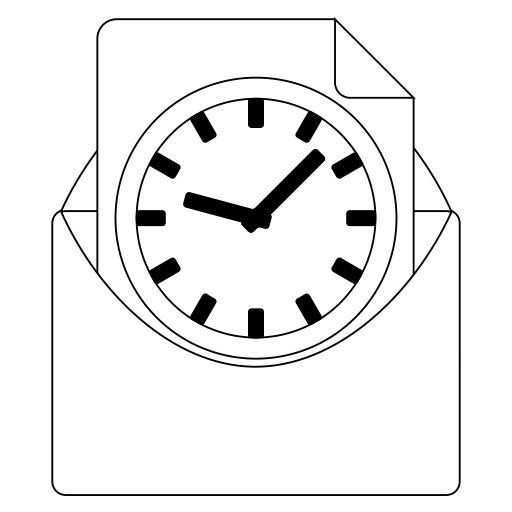

# Periodical File Sender (PFS)
#### (Formerly known as Periodical Email Sender - PES)

#### GUI-based tool to send emails with attachment periodically using an SMTP server

## Description

**Periodical File Sender** is a simple automation application that was designed
according to one client needs. This desktop application features an intuitive
user interface composed of two tabs: **Settings** and **Sending options**.

### Settings

This is the first view that appears in the first run of the application. It
shows the permanent settings that should be set in order to make the
application work. It is made of several sections:

#### Mail server settings

In this section the user has to enter the hostname, the port, and the SSL/TLS
status of the SMTP server that will be used for sending the emails. This
information can be obtained from the email service provider.

#### Login

The next section holds the username and the password that will be used for
authentication. This information should also be provided by the email service
provider.

#### Sender information

This section specifies the name and the email address that will be displayed
to the receiver.

_Although the user can put anything here, most SMTP servers
will not allow you to put anything other than what represents your real
identity on the email service provider. Even if a service provider allows
you to misrepresent the identity, the email will most likely ends up in the
spam folder of the receiver because it will be flagged as a non-legitimate
email._

#### Tasks file

The last section allows the selection of the tasks file where the periodical
sending tasks will be saved.

Finally, these settings must be saved using the <kbd>Save</kbd> button at the
bottom. This will instantly generate a `settings.ini` file in the current
working directory and allows the user to use the **Sending options** tab.

## Sending options

This tab is where the user can create, edit, and delete the sending tasks. It
contains buttons to add, edit, and delete tasks. It also contains a table that
shows the tasks that are currently saved in the tasks file. When a task is selected
in the table, the **Email details** section will be populated with its details.

To add a new task, the user has to click on the <kbd>Add</kbd> button. This will
open a new window where the user can enter the details of the email to be sent.
The fields in this window are: **To** which should contain the email address of 
the receiver, **Subject** which should contain the subject of the email, and 
**Content** which should contain the content of the email.

Below, there is an **Attachment** section where the user can add a file to be
attached to the email. The user can either enter the path of the file manually
or click on the <kbd>Browse</kbd> button to select the file using a file chooser
dialog.

Beside the **Attachment** section, there is a **Schedule** section where the user
can specify the frequency of sending the email. The user can indicate the count
and the unit of the frequency. The available units are: **minutes**, **hours**,
**days**, **weeks**, **months**, and **years**.

## Monitoring status

In the status bar of the application, there is a button that shows the current
monitoring status. By default, the monitoring is disabled, which means that the
sending tasks will not be executed unless the <kbd>Send now</kbd> button is clicked.
When the user clicks on the button, the monitoring will be enabled and the sending
tasks are executed according to their schedule.